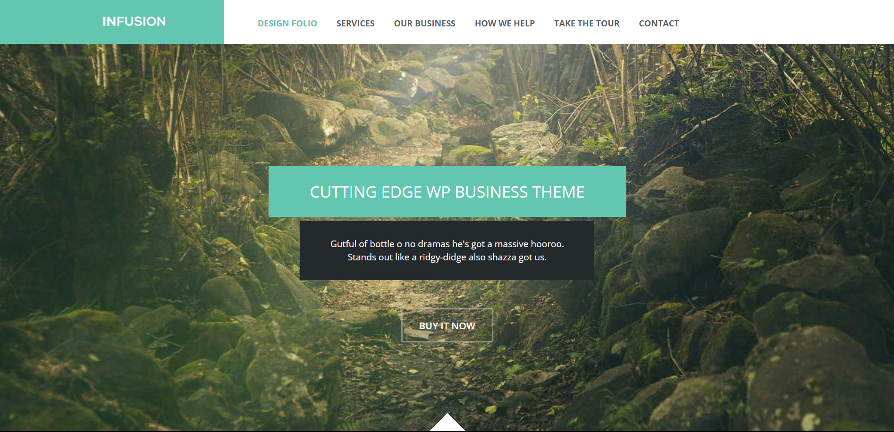

# Projeto do curso da Udemy.

Este um projeto final de um **Curso** da Udemy. Ele é bem simples e ao mesmo tempo completo com HTML, CSS e um pouco de JS. Segue o link abaixo de como ficou, Ao vivo!

## Live site:

Clique [neste link azul](https://cauathiago.github.io/projeto-Infusion-Udemy/), para ter acesso ao site rodando ao vivo.

## Screem do site:

## Desenvolvido por??

Links do Autor:

 

 
